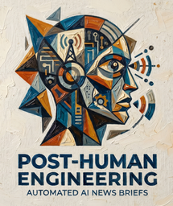

  

   
  
  # 🌐 The Post-Human Briefing
  
  **Your Daily Injection of AI, Markets & Macro News.**
  
  
  
  ---

### 🚀 What is this?
**The Post-Human Briefing** is a fully automated, agent-curated news platform that synthesizes the most critical developments in Artificial Intelligence, global finance, and macroeconomics into twice-daily (Morning and Evening) comprehensive briefings.

### ✨ Features
* **Automated Intelligence:** News is scraped, synthesized, and formatted entirely by AI agents.
* **Neural Audio Briefings:** Don't want to read? Listen to the broadcast-quality, AI-generated audio narration for every post, powered by Microsoft Edge Neural TTS.
* **Sleek & Dynamic UI:** Built with modern web aesthetics, offering a seamless and beautiful reading experience.

 

  <h2>👉 <a href="https://nkhola.github.io/ainews/">Click Here to Read the Latest Briefings</a> 👈</h2>

