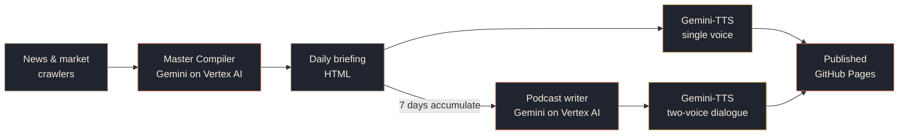

 

 
 

# The Post-Human Briefing

**Frontier AI &nbsp;·&nbsp; Global markets &nbsp;·&nbsp; Zero human editors**

*Written, narrated, and published twice a day by autonomous agents on Vertex AI.*

 

 

Most news is noise. The Post-Human Briefing is a fully autonomous editorial pipeline that reads the day's AI and finance firehose, resolves the contradictions, and publishes what actually mattered, with a *why it matters* attached to every thread. No aggregation, no headlines-as-a-service: synthesis.

 

## Three formats, one system

| | Format | Cadence | What it is |
|---|---|---|---|
| 📰 | **The Briefing** | Twice daily · 9 AM & 6 PM ET | Cross-linked synthesis of AI and macro developments, written in the voice of a domain expert with skin in the game. |
| 🎧 | **The Narration** | With every briefing | Broadcast-quality audio of each briefing, spoken by a single continuous Gemini voice. Listen on the commute. |
| 🎙️ | **The Post-Human Debrief** | Weekly · Sunday evening | A two-voice conversational podcast. The entire week of briefings distilled into one anchor-and-analyst conversation, scripted and voiced end-to-end by the pipeline. |

 

## How it works

The editorial layer is a "Master Compiler" agent with strict anti-cliché guards and a mandatory *why-it-matters* mechanism for every theme; synthesis is enforced, not hoped for. Audio uses Gemini-TTS on Vertex AI: single-voice continuous narration for the dailies, and native multi-speaker synthesis (two prebuilt voices in one request) for the weekly Debrief, so the conversation has real back-and-forth rhythm instead of stitched-together monologues.

Everything runs on scheduled GitHub Actions with workload-identity federation into GCP. No servers, no keys in the repo, no humans in the loop.

 

### [**Read today's briefing →**](https://nkhola.github.io/ainews/)

 

---

### ⚖️ Legal & Copyright

**© 2026 Nitin Khola / Post-Human Engineering. All Rights Reserved.**

This repository and the generated output are proprietary. The source code, automation scripts, visual aesthetics, and content structure are **NOT** open source.
* **Copyright:** You may not copy, clone, distribute, or create derivative works from this codebase. See the [LICENSE](LICENSE) file for full details.
* **Trademarks:** "Post-Human Engineering™", "The Post-Human Briefing™", and "The Post-Human Debrief™" are trademarks. Unauthorized use of this branding, name, or logo is strictly prohibited.
